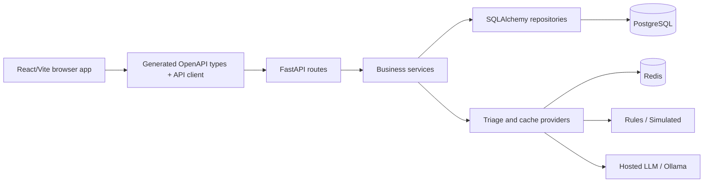

# CivicPulse

CivicPulse is a municipal complaint intake and operations platform. Residents submit free-text complaints, a replaceable triage provider assigns category and priority, and operators review, filter, and advance complaints through an explicit status workflow.

## Architecture



Routes handle HTTP only. Services own orchestration and business rules, repositories own SQL, and providers isolate Redis and model integrations. The frontend renders backend decisions and does not duplicate the status-transition table.

## Implemented workflows

- Complaint submission with client and server validation, loading feedback, triage result, provider, and rate-limit feedback.
- Operations dashboard with pagination, category/priority/status filters, and backend-enforced status transitions.
- Statistics by category and priority with visible `X-Cache: HIT|MISS` behavior.
- Rules, simulated, hosted LLM, and Ollama triage providers selected through configuration.
- Structured output validation, ten-second provider timeout, one jittered retry, and deterministic rules fallback.
- PostgreSQL persistence through Alembic migrations.
- Redis statistics cache, content-hash triage cache, and distributed fixed-window rate limiter.
- JSON logging with request ID propagation and Prometheus metrics.

## Prerequisites

- Python 3.11 or newer
- Node.js 20 or newer and npm
- PostgreSQL 16
- Redis 7

Containerized startup is developed separately from this application-completion branch.

## Backend quickstart

From a clean clone, create an ignored `.env` from `.env.example`, replace its development placeholders, and install the backend:

```powershell
cd backend
python -m pip install -e ".[dev]"
```

Set service URLs, apply the migration, seed the database, and start FastAPI:

```powershell
$env:DATABASE_URL = "postgresql+asyncpg://civicpulse:<local-password>@localhost:5432/civicpulse"
$env:REDIS_URL = "redis://localhost:6379/0"
alembic upgrade head
cd ..
python scripts/seed.py
cd backend
uvicorn app.main:app --reload
```

The seed command is idempotent. The first run creates 30 complaints; the second reports that all 30 already exist.

## Frontend quickstart

In a second terminal:

```powershell
cd frontend
npm install
npm run dev
```

Open <http://localhost:5173>. Vite proxies `/api`, `/health`, and `/ready` to the local backend. `/config.js` supplies the public API base at runtime, so the frontend bundle contains no environment-specific backend URL or secret.

## API contract

| Method | Path | Behavior |
| --- | --- | --- |
| `POST` | `/api/complaints` | Validate, triage, and persist; returns `201`, field-level `400`, or rate-limit `429` |
| `GET` | `/api/complaints/{id}` | Retrieve one complaint; returns `404` when absent |
| `GET` | `/api/complaints` | Filter by category, priority, and status; paginate up to 100 rows |
| `PATCH` | `/api/complaints/{id}/status` | Apply the explicit state machine; invalid transitions return descriptive `409` |
| `GET` | `/api/stats` | Category and priority aggregates with `X-Cache: HIT|MISS` |
| `GET` | `/api/meta/providers` | Active provider, last 20 outcomes, latency, fallback, and cache-hit rate |
| `GET` | `/health` | Process liveness without dependency access |
| `GET` | `/ready` | PostgreSQL and Redis readiness with failed dependency name |
| `GET` | `/metrics` | Prometheus counters and request/triage latency histograms |

The committed [OpenAPI schema](backend/openapi.json) generates [frontend type declarations](frontend/src/api/schema.d.ts). Verify contract synchronization with:

```powershell
cd frontend
npm run check:api
```

## Validation

Backend tests enforce at least 65% coverage:

```powershell
cd backend
pytest -q
ruff check app tests alembic ..\scripts
python -m compileall app tests alembic ..\scripts
```

Frontend:

```powershell
cd frontend
npm test -- --run
npm run check:api
npm run build
```

The current measured backend coverage is 95.83% across 37 passing tests. Six meaningful frontend workflow tests pass.

## Operations behavior

Uvicorn handles `SIGTERM` by stopping acceptance of new connections and waiting for in-flight requests. FastAPI lifespan shutdown then closes the SQLAlchemy engine and Redis client. Container orchestration must provide a termination grace period at least as long as Uvicorn's graceful-shutdown timeout.

Every application log is JSON and includes `request_id`. Incoming `X-Request-ID` values are propagated; otherwise the backend generates one and returns it in the response. Triage fallback warnings also include complaint ID, provider, and error class.

See [docs/RUNBOOK.md](docs/RUNBOOK.md) for operational diagnosis, [docs/ENGINEERING-NOTES.md](docs/ENGINEERING-NOTES.md) for measured decisions and pending infrastructure evidence, and [docs/AI-USAGE.md](docs/AI-USAGE.md) for attribution.
